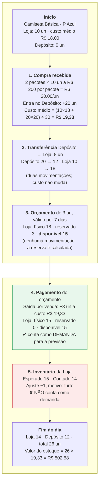

# Estoque — exemplo de um dia (proposta)

> **Status:** proposta para a entrevista de 28/10/2026, a validar

```mermaid
flowchart TB
  S0["<b>Início</b><br/>Camiseta Básica · P Azul<br/>Loja: 10 un · custo médio R$ 18,00<br/>Depósito: 0 un"]
  S1["<b>1. Compra recebida</b><br/>2 pacotes × 10 un a R$ 200 por pacote = R$ 20,00/un<br/>Entra no Depósito: +20 un<br/>Custo médio = (10×18 + 20×20) ÷ 30 = <b>R$ 19,33</b>"]
  S2["<b>2. Transferência</b> Depósito → Loja: 8 un<br/>Depósito 20 → 12 · Loja 10 → 18<br/>(duas movimentações; custo não muda)"]
  S3["<b>3. Orçamento</b> de 3 un, válido por 7 dias<br/>Loja: físico 18 · reservado 3 · <b>disponível 15</b><br/>(nenhuma movimentação: a reserva é calculada)"]
  S4["<b>4. Pagamento</b> do orçamento<br/>Saída por venda: −3 un a custo R$ 19,33<br/>Loja: físico 15 · reservado 0 · disponível 15<br/>✔ conta como DEMANDA para a previsão"]
  S5["<b>5. Inventário</b> da Loja<br/>Esperado 15 · Contado 14<br/>Ajuste −1, motivo: furto<br/>✘ NÃO conta como demanda"]
  S6["<b>Fim do dia</b><br/>Loja 14 · Depósito 12 · total 26 un<br/>Valor do estoque = 26 × 19,33 = R$ 502,58"]
  subgraph A[" "]
    direction LR
    S0 --> S1 --> S2 --> S3
  end
  subgraph B[" "]
    direction LR
    S4 --> S5 --> S6
  end
  S3 --> S4
  style S4 fill:#e8f7ec,stroke:#2e9e57
  style S5 fill:#fdeaea,stroke:#d04545
```
