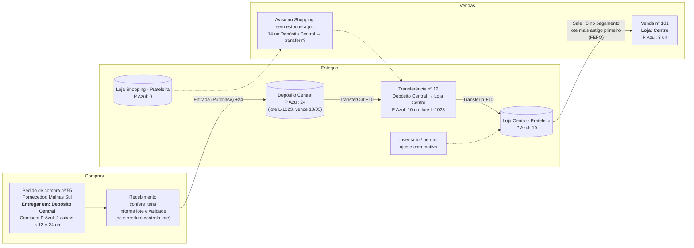

# Fluxo compra → depósito → venda (visão Admin, proposta)

> **Status:** proposta de 28/10/2026, a validar

```mermaid
flowchart LR
  subgraph COMPRA["Compras"]
    PC["Pedido de compra nº 55<br/>Fornecedor: Malhas Sul<br/><b>Entregar em: Depósito Central</b><br/>Camiseta P Azul: 2 caixas × 12 = 24 un"]
    REC["Recebimento<br/>confere itens<br/>informa lote e validade<br/>(se o produto controla lote)"]
  end
  subgraph EST["Estoque"]
    DC[("Depósito Central<br/>P Azul: 24<br/>(lote L-1023, vence 10/03)")]
    TR["Transferência nº 12<br/>Depósito Central → Loja Centro<br/>P Azul: 10 un, lote L-1023"]
    LC[("Loja Centro · Prateleira<br/>P Azul: 10")]
    LS[("Loja Shopping · Prateleira<br/>P Azul: 0")]
    INV["Inventário / perdas<br/>ajuste com motivo"]
  end
  subgraph VENDA["Vendas"]
    PV["Venda nº 101<br/><b>Loja: Centro</b><br/>P Azul: 3 un"]
    AV["Aviso no Shopping:<br/>sem estoque aqui,<br/>14 no Depósito Central → transferir?"]
  end
  PC --> REC -->|"Entrada (Purchase) +24"| DC
  DC -->|"TransferOut −10"| TR -->|"TransferIn +10"| LC
  LC -->|"Sale −3 no pagamento<br/>lote mais antigo primeiro (FEFO)"| PV
  LS -.-> AV -.-> TR
  INV -.-> LC
```
