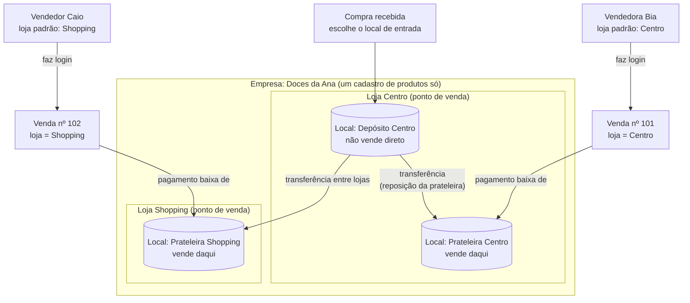

# Estoque — lojas e locais (proposta)

> **Status:** proposta para a entrevista de 28/10/2026, a validar

```mermaid
flowchart TB
  subgraph EMP["Empresa: Doces da Ana (um cadastro de produtos só)"]
    direction TB
    subgraph L1["Loja Centro (ponto de venda)"]
      direction LR
      A1[("Local: Prateleira Centro<br/>vende daqui")]
      A2[("Local: Depósito Centro<br/>não vende direto")]
    end
    subgraph L2["Loja Shopping (ponto de venda)"]
      direction LR
      B1[("Local: Prateleira Shopping<br/>vende daqui")]
    end
  end

  U1["Vendedora Bia<br/>loja padrão: Centro"] -->|"faz login"| V1["Venda nº 101<br/>loja = Centro"]
  U2["Vendedor Caio<br/>loja padrão: Shopping"] -->|"faz login"| V2["Venda nº 102<br/>loja = Shopping"]
  V1 -->|"pagamento baixa de"| A1
  V2 -->|"pagamento baixa de"| B1
  A2 -->|"transferência<br/>(reposição da prateleira)"| A1
  A2 -->|"transferência entre lojas"| B1
  C["Compra recebida<br/>escolhe o local de entrada"] --> A2
```
